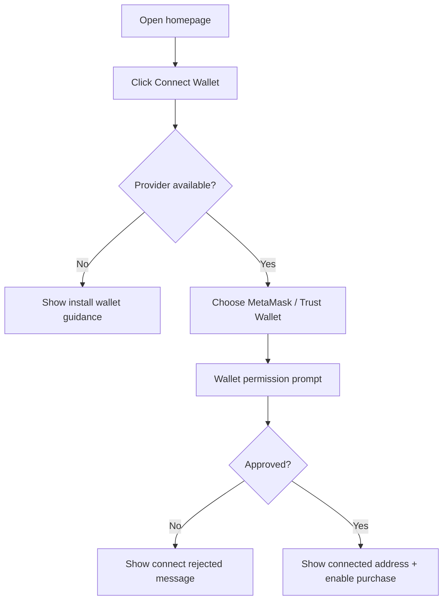
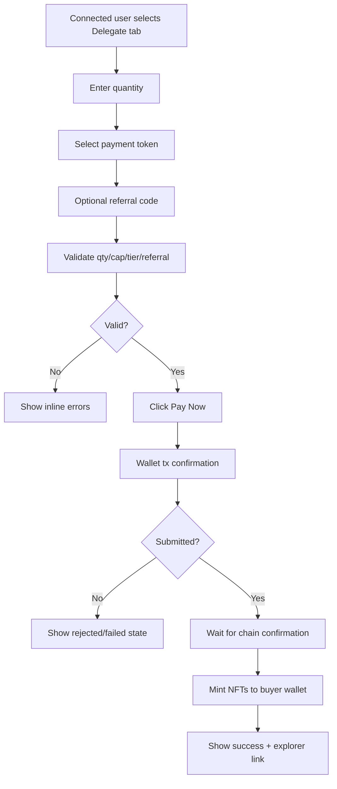
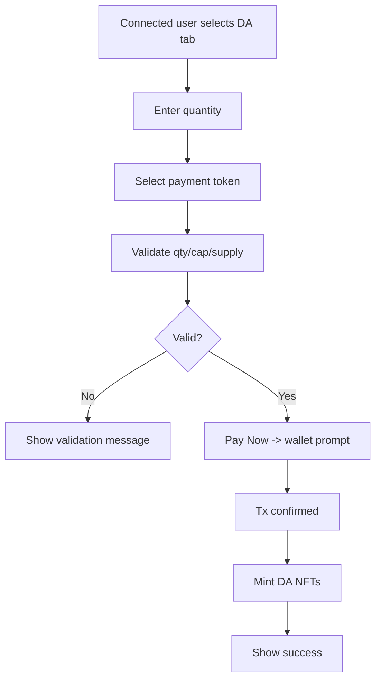
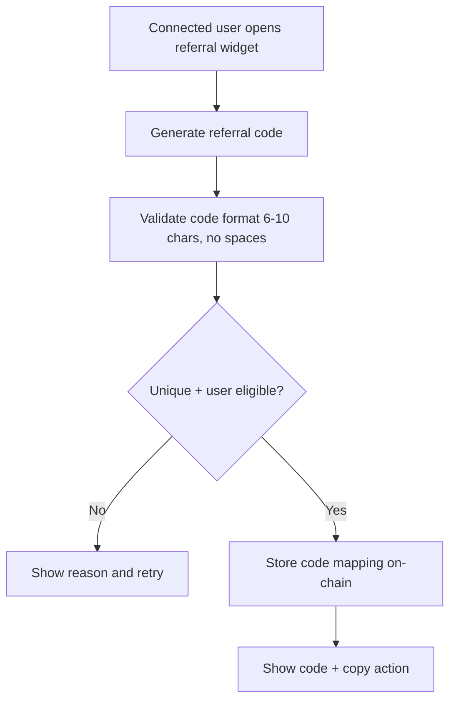
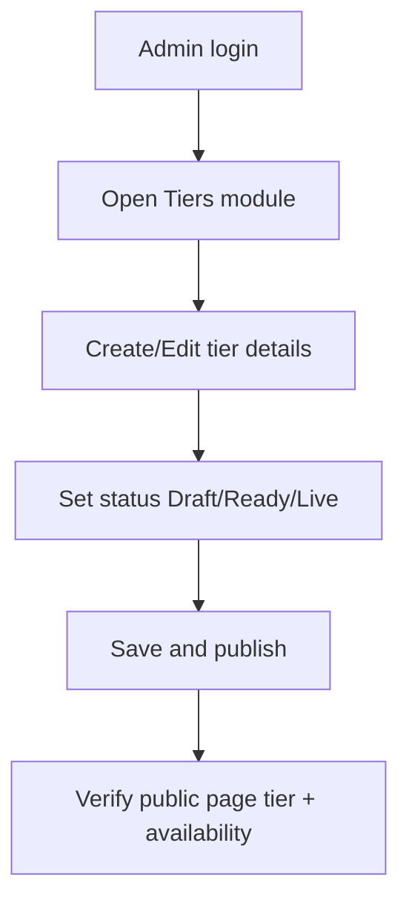

# User Flows — GPT Protocol Node Sale Platform

## 1) Buyer Wallet Connection Flow

## 2) Delegate Purchase Flow (with optional referral)

## 3) DA Purchase Flow

## 4) Referral Code Generation Flow

## 5) Admin Tier Management Flow

## 6) Admin Orders Investigation Flow
1. Open Orders module.
2. Apply filters (referral/date/qty/amount/token/status).
3. Inspect order details (wallet, tx hash, node type, quantity).
4. Cross-check explorer if status mismatch exists.
5. Export CSV for support/finance follow-up.

## 7) Critical Edge Cases
- User tries to buy above wallet cap.
- Tier inventory depleted between quote and submit.
- ERC20 allowance insufficient after user changes quantity.
- User enters inactive referral code.
- RPC latency causes delayed confirmation in UI.
