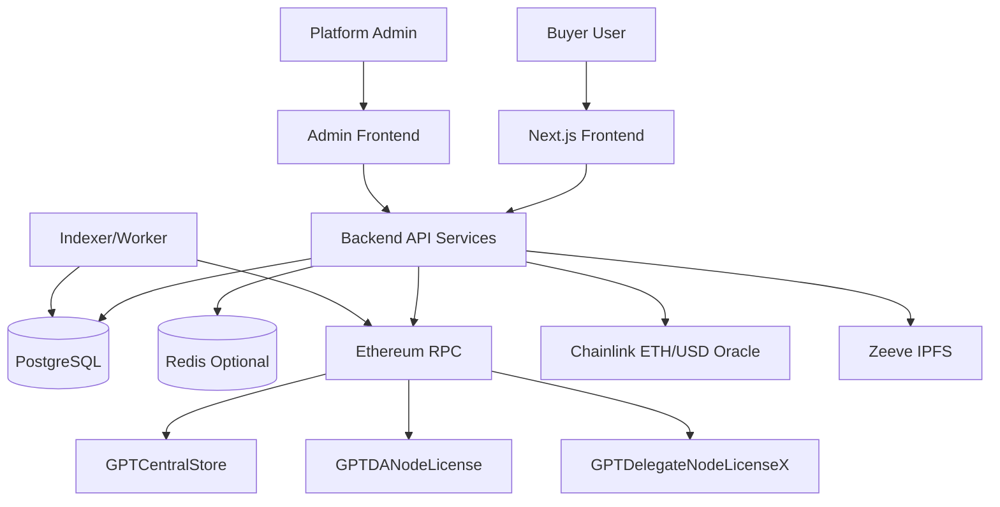
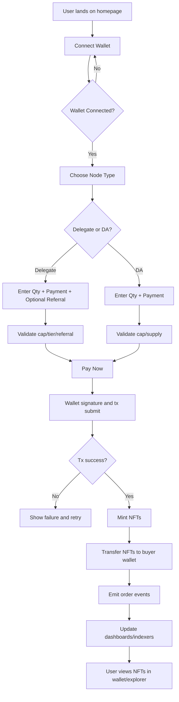
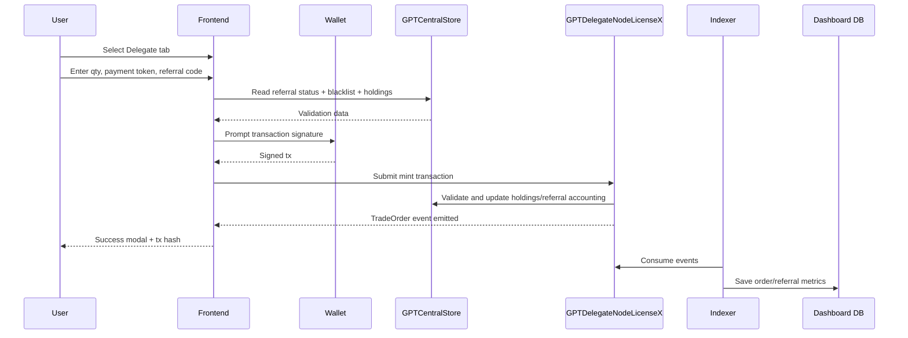
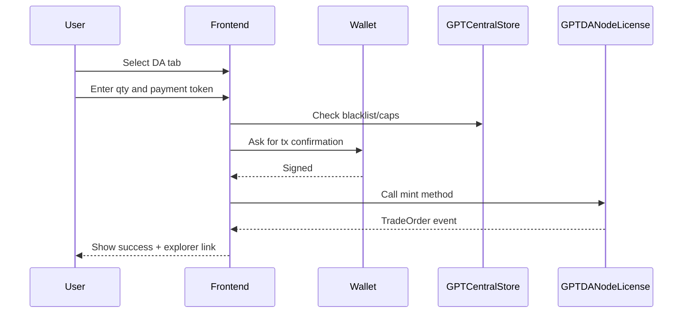
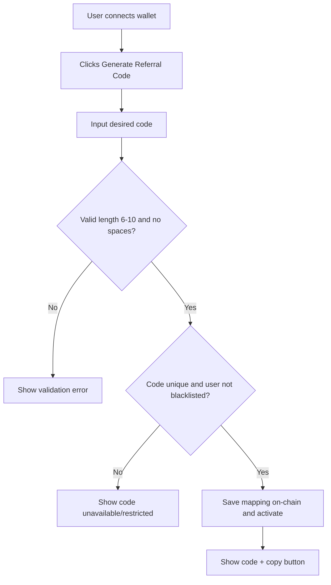
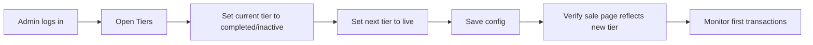
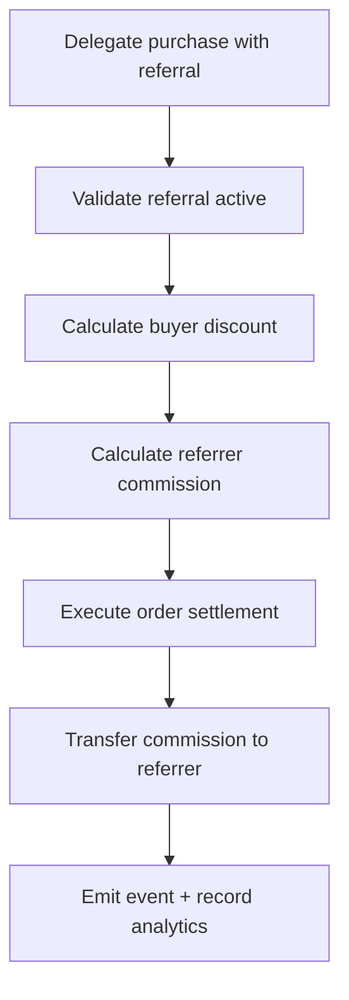

# Software Requirements Specification (SRS)
## GPT Protocol Node Sale Platform

**Prepared for:** GPT Protocol  
Intershore Chambers, Geneva Place, 3rd Floor, Road Town, Tortola, VG1110  
Website: https://gptprotocol.org

**Prepared by:**  
- Lalit Kumar Sharma (Sr. Technical Consultant)  
- Prateek Jha (Sr. Blockchain Consultant & Project Manager)

**Document Type:** Master Functional + Technical SRS  
**Document Version:** 2.1 (Detailed Expanded Edition)  
**Document Date:** April 9, 2026

---

## Document Revision History

| Date | Revision No. | Remarks |
|---|---:|---|
| 20-Nov-2024 | 1.0 | Document created |
| 29-Nov-2024 | 1.0 | First draft |
| 09-Apr-2026 | 2.0 | Full SRS with architecture and wireframes |
| 09-Apr-2026 | 2.1 | Expanded detailed SRS with complete granular flows, detailed wireframes, screen-level behavior, and contract operations |

---

## Table of Contents
1. [Introduction](#1-introduction)
2. [Scope](#2-scope)
3. [Business and Process Requirements](#3-business-and-process-requirements)
4. [Detailed Functional Requirements](#4-detailed-functional-requirements)
5. [Screen-by-Screen UX Specifications](#5-screen-by-screen-ux-specifications)
6. [Detailed Wireframes (ASCII)](#6-detailed-wireframes-ascii)
7. [Branding and Design System](#7-branding-and-design-system)
8. [System Architecture and Design](#8-system-architecture-and-design)
9. [Blockchain Smart Contract Specifications](#9-blockchain-smart-contract-specifications)
10. [Data Model and Data Dictionary](#10-data-model-and-data-dictionary)
11. [Operational Workflows and Flow Charts](#11-operational-workflows-and-flow-charts)
12. [Admin Portal Detailed Requirements](#12-admin-portal-detailed-requirements)
13. [Security, Auditability, and Compliance Controls](#13-security-auditability-and-compliance-controls)
14. [Non-Functional Requirements](#14-non-functional-requirements)
15. [Testing and Acceptance Criteria](#15-testing-and-acceptance-criteria)
16. [Deployment, Environment, and Runbook](#16-deployment-environment-and-runbook)
17. [Open Items, Dependencies, Assumptions](#17-open-items-dependencies-assumptions)
18. [Appendix A: Contract Operations Reference](#18-appendix-a-contract-operations-reference)
19. [Appendix B: Event Catalog](#19-appendix-b-event-catalog)
20. [Appendix C: UI Copy Bank](#20-appendix-c-ui-copy-bank)

---

## 1. Introduction

### 1.1 Purpose
This Software Requirements Specification (SRS) provides detailed business, product, engineering, blockchain, and operational requirements for the **GPT Protocol Node Sale Platform**. The platform is designed to sell node licenses as ERC-721 NFTs with two node categories:
- **Delegate Node Licenses** (tier-based)
- **DA Node Licenses** (single-price model)

This SRS is intentionally detailed and includes all required flows, constraints, and behaviors from the project brief, including wallet onboarding, node purchasing, referral discounts, commission payouts, tier transitions, admin configuration, smart contract roles/functions/events, IPFS metadata handling, and reporting features.

### 1.2 Audience
This document is intended for:
- Business stakeholders and project sponsors
- Product managers and business analysts
- Frontend developers
- Backend developers
- Smart contract developers and auditors
- QA teams
- DevOps/SRE teams
- Security reviewers

### 1.3 Product Goal
To provide a secure, transparent, and scalable web platform that enables users to purchase and own GPT node licenses as NFTs with clear pricing, referral incentives, and auditable on-chain behavior.

### 1.4 Project Overview
The platform allows users to:
1. Connect wallet (MetaMask, Trust Wallet)
2. Choose node type (Delegate / DA)
3. Enter quantity (subject to caps and availability)
4. Select payment token (GPT/USDT/USDC/ETH)
5. (Delegate only) apply referral code for discount
6. Sign payment transaction from wallet
7. Receive minted ERC-721 license NFTs in wallet

The platform allows admins to:
1. Configure tier inventory and pricing
2. Configure blockchain details
3. Configure discount/commission percentages
4. Blacklist/whitelist users
5. Manage referral code activation
6. Monitor sales and referral analytics

---

## 2. Scope

### 2.1 In Scope
- Public node-sale website
- Buyer wallet connection and purchase journeys
- Delegate and DA node product types
- Multi-token payments (GPT, USDT, USDC, ETH)
- Tier logic (one live tier at a time for Delegate)
- Referral code generation and usage (Delegate only)
- Discount and commission application
- NFT minting and delivery to buyer wallet
- Admin portal for sales and chain configuration
- Dashboard and reporting (orders/referrals)
- Contract-based control and events
- IPFS metadata support

### 2.2 Out of Scope (Current Phase)
- Fiat payment gateways
- Advanced KYC/AML workflows (unless separately scoped)
- Custodial wallet infrastructure
- Native mobile application
- Secondary marketplace implementation

### 2.3 Base Currency and Price Conversion
- Base business currency: **USD**
- ETH conversion source: decentralized oracle feed (Chainlink style)
- GPT conversion source: admin-configured manual update interval

---

## 3. Business and Process Requirements

### 3.1 High-Level Business Processes
1. Generic setup and sale configuration
2. User registration by wallet connect
3. Delegate and DA sale processing
4. Referral generation and usage
5. Commission settlement
6. Token minting and NFT delivery
7. Reporting and operational monitoring

### 3.2 Generic Product Requirements
- Node licenses are sold as ERC-721 NFTs.
- Delegate licenses are tiered (tier quantity + tier price).
- Only one Delegate tier may be active at a given time.
- DA node licenses are sold at a single configured price.
- User-facing availability should reflect total/sold/remaining inventory.
- Platform should permit only valid transactions and maintain complete auditability.

### 3.3 Node Sale Types

| Node Type | Pricing Model | Quantity Model | Referral Allowed | Wallet Cap |
|---|---|---|---|---|
| Delegate Node License | Tier-based | Tier supply fixed per tier | Yes | 100 (default, configurable) |
| DA Node License | Single unit price | One supply bucket | No | 1 (default, configurable) |

### 3.4 Tier Sell-Through Requirement
If user wants to buy quantity `Q` and active tier has remaining quantity `R` where `R < Q`, then:
- User must place one order for `R` in current tier
- User must place second order for `Q-R` in next tier after next tier is live
- Cross-tier auto-split in one single on-chain purchase transaction is **not allowed** unless explicitly implemented later

### 3.5 Payment Methods
Accepted payment methods:
- GPT
- USDT
- USDC
- ETH

### 3.6 Referral Business Logic
- One wallet can generate only one referral code.
- Referral code length must be 6–10 chars, no spaces.
- Delegate purchase can apply referral for discount (default 10%).
- Referral owner receives commission (default 10%).
- Both discount and commission are configurable in backend and persisted on-chain.
- DA purchase does not accept referral discount.

---

## 4. Detailed Functional Requirements

### 4.1 User Registration and Wallet Connect

#### FR-REG-001: Homepage Access
- User can access homepage without connecting wallet.
- Pricing and availability panels are visible in read-only mode.

#### FR-REG-002: Connect Wallet CTA
- “Connect Wallet” button visible on header and purchase module.
- Clicking opens wallet options popup with:
  - MetaMask
  - Trust Wallet

#### FR-REG-003: Wallet Provider Flow
- On wallet selection, wallet auth request is initiated.
- If MetaMask locked, user sees password unlock screen in extension.
- User selects account to connect.
- User confirms permission screen.

#### FR-REG-004: Post Connect State
- Connected wallet short address shown in UI.
- Disconnect option must be available.
- Session state retained on page navigation unless wallet disconnected.

#### FR-REG-005: Errors
- Wallet extension missing: show install prompt.
- User rejects connection: show informational error.
- Unsupported chain: show chain switch guidance.

### 4.2 Delegate Purchase Flow Functional Details

#### FR-DEL-001: Delegate Tab
- Delegate tab includes:
  - current live tier number
  - price per license
  - available licenses
  - quantity field
  - payment token dropdown
  - referral code input
  - computed total amount
  - Pay Now button

#### FR-DEL-002: Quantity Validation
- Quantity must be integer > 0.
- Quantity must not exceed active tier availability.
- Quantity must not violate per-wallet cumulative cap.

#### FR-DEL-003: Referral Input Rules
- Referral code field active for Delegate.
- If referral code invalid/inactive: block discounted transaction, show error.
- If valid: apply configured discount in total calculation.

#### FR-DEL-004: Pricing Display
- Display unit USD price.
- Display converted token amount depending on selected payment method.
- ETH conversion uses oracle.
- GPT conversion uses configured GPT-per-USD parameter.

#### FR-DEL-005: Payment Flow
1. User clicks Pay Now
2. Wallet transaction request is generated
3. User approves transaction in wallet
4. Transaction submitted on-chain
5. UI shows pending state with tx hash
6. On confirmation, success message: “You have successfully purchased X Licence(s)”

#### FR-DEL-006: Post Purchase
- NFT licenses appear in wallet/explorer.
- Order recorded for dashboard/reporting.

### 4.3 DA Purchase Flow Functional Details

#### FR-DA-001: DA Tab
- DA tab includes:
  - price per license
  - available licenses
  - quantity field
  - payment token dropdown
  - total amount
  - Pay Now

#### FR-DA-002: No Referral
- Referral field is hidden/disabled for DA flow.
- Any referral parameter should be ignored/rejected by backend/contract route.

#### FR-DA-003: Quantity Validation
- Quantity > 0
- Quantity within DA per-wallet cap (default 1)
- Quantity <= remaining DA supply

#### FR-DA-004: Transaction and Success
- Same wallet signing and on-chain confirmation process as Delegate.
- Success pop-up: “You have successfully purchased X Licence(s)”

### 4.4 Referral Code Generation and Usage

#### FR-REF-001: Generate Referral
- UI includes “Get your Referral Code” area.
- Button: “Generate Referral Code”.
- On success: show generated code and copy button.

#### FR-REF-002: One Code per Wallet
- If wallet already has code, generating new one is blocked.

#### FR-REF-003: Referral Constraints
- Length 6–10 characters
- No spaces
- Must be unique globally

#### FR-REF-004: Referral Commission
- On each eligible Delegate purchase with referral:
  - buyer gets configured discount
  - referrer gets configured commission

### 4.5 Minting and Airdropping to Wallet Address

#### FR-MINT-001: Immediate Minting
- After successful payment, quantity `Q` NFTs are minted.
- Ownership assigned directly to buyer wallet.

#### FR-MINT-002: Metadata
- tokenURI resolves to IPFS metadata URI.
- Metadata JSON includes NFT name, image, symbol, attributes.

#### FR-MINT-003: Transfer Lock
- Direct transfer locked for 12 months from mint timestamp.

### 4.6 Admin Configuration Functional Requirements

#### FR-ADM-001: Tiers Management
Admin can create/update for each tier:
- Tier type (Delegate/DA)
- Tier number
- License unit cost (USD; optional INR display)
- Total licenses
- Sold licenses
- Remaining licenses
- Contract address
- Status: Draft / Ready-to-go-live / Live / In-Progress / Completed

#### FR-ADM-002: Blockchain Configuration
Admin can configure:
- Contract address(es)
- RPC URL
- Chain ID
- Payment RPC URL
- Super admin address

#### FR-ADM-003: Referral/Commission Config
- Referred discount percentage
- Referrer commission percentage
- Activate/deactivate referral codes

#### FR-ADM-004: User Controls
- Blacklist user
- Whitelist user

#### FR-ADM-005: Analytics Views
- Dashboard
- Discount trends
- Top 5 ranking
- Mostly used referral codes
- All orders table
- Filters: referral code, date range, quantity, total amount

---

## 5. Screen-by-Screen UX Specifications

### 5.1 Public Homepage (Without Wallet)
Sections:
1. Header with logo and nav
2. Intro/hero content
3. Purchase module with tabs (Delegate/DA)
4. Referral widget (visible, but generation disabled until wallet connect)
5. Footer

States:
- Wallet disconnected: purchase controls disabled or prompts connect first
- Wallet connected: full purchase interaction enabled

### 5.2 Wallet Popup UX
Modal content:
- Title: Connect Wallet
- Buttons:
  - MetaMask
  - Trust Wallet
- Secondary: Learn how to install wallet
- Error panel for unavailable extension

### 5.3 MetaMask Connection User Journey (Detailed)
1. User clicks Connect Wallet on homepage.
2. Wallet options popup appears.
3. User clicks MetaMask.
4. MetaMask extension opens.
5. If locked, user enters password and unlocks.
6. User chooses account (if multiple).
7. User confirms permission request.
8. Wallet address appears connected in dApp.
9. User may disconnect later from account menu.

### 5.4 Delegate Purchase Form UX
Fields and controls:
- Current live tier badge
- Unit price
- Available out of total
- Quantity input
- Payment method dropdown
- Referral code text input
- Discount summary row
- Total amount row
- Pay Now button

Validation UX:
- Inline errors under field
- Disable Pay Now while invalid/pending
- Show processing spinner during tx signing

### 5.5 DA Purchase Form UX
Fields and controls:
- Unit price
- Available out of total
- Quantity input
- Payment method dropdown
- Total amount row
- Pay Now

Difference from Delegate:
- No referral input
- No referral discount row

### 5.6 Success and Failure UX
- Pending modal with tx hash + explorer link
- Success modal with quantity and optional token ID range
- Failure modal with retry guidance

### 5.7 Referral Widget UX
- “Get your Referral Code” heading
- Generate button
- Display code
- Copy icon/button
- Commission helper text

### 5.8 Admin Login UX
- Username/email
- Password
- MFA placeholder (if enabled)
- Forgot password link (optional)

### 5.9 Admin Dashboard UX
- KPI cards
- Trends graphs
- Ranking panels
- Orders quick table
- Global filters

---

## 6. Detailed Wireframes (ASCII)

### 6.1 Public Homepage (Desktop)

```text
+================================================================================================+
| GPT PROTOCOL LOGO                           [Docs] [Support] [Connect Wallet / 0x12ab...90ef] |
+================================================================================================+
| HERO                                                                                        |
| "Buy GPT Node Licenses as NFTs"                                                            |
| "Transparent on-chain purchase, instant ownership, referral rewards"                      |
+-----------------------------------------------+-----------------------------------------------+
| Purchase License                              | Referral Program                              |
|-----------------------------------------------|-----------------------------------------------|
| Tabs: [Delegate Node] [DA Node]              | Get your Referral Code                         |
|-----------------------------------------------|-----------------------------------------------|
| Current Tier: Delegate Tier 2                | [Generate Referral Code]                       |
| Price / License: $YY2                         | Your Code: VCD43 [Copy]                        |
| Available: 1240 / 2000                        | "Earn rewards when others use your code"      |
| Quantity: [ 5 ]                               |                                               |
| Pay with: [ETH v]                             |                                               |
| Referral Code: [__________]                   |                                               |
| Discount: -10%                                |                                               |
| Total Amount: $X | ETH Y                      |                                               |
| [ Pay Now ]                                   |                                               |
+-----------------------------------------------+-----------------------------------------------+
| Footer: Terms | Privacy | Smart Contracts | Explorer | Contact                               |
+================================================================================================+
```

### 6.2 Wallet Connect Popup

```text
+-------------------------------------------------------------+
| Connect Wallet                                              |
| Choose an EVM compatible wallet to continue                 |
|                                                             |
| [ MetaMask ]                                                |
| [ Trust Wallet ]                                            |
|                                                             |
| Missing wallet extension? [Install Guide]                  |
+-------------------------------------------------------------+
```

### 6.3 Transaction Status Modals

```text
+-------------------------------------------------------------+
| Transaction Submitted                                       |
| Tx Hash: 0xabc123...f789                                   |
| Status: Pending blockchain confirmation                     |
| [ View on Explorer ] [ Close ]                             |
+-------------------------------------------------------------+

+-------------------------------------------------------------+
| Purchase Successful                                         |
| You have successfully purchased 5 Licence(s).              |
| Owned Token IDs: #1021, #1022, #1023, #1024, #1025         |
| [ View in Wallet ] [ View on Explorer ] [ Done ]           |
+-------------------------------------------------------------+

+-------------------------------------------------------------+
| Transaction Failed                                          |
| Reason: User rejected transaction / insufficient allowance  |
| [ Retry ] [ Change Payment Method ] [ Close ]              |
+-------------------------------------------------------------+
```

### 6.4 Admin Login

```text
+-------------------------------------------------------------+
| Admin Login                                                 |
| Email/Username: [__________________________]                |
| Password:       [__________________________]                |
| [ Sign In ]                                                 |
| Forgot password?                                            |
+-------------------------------------------------------------+
```

### 6.5 Admin Dashboard

```text
+================================================================================================+
| Admin Portal | Dashboard | Partners | Tiers | Orders | Configuration | Logout                 |
+================================================================================================+
| KPI: Gross Sales | Licenses Sold | Active Tier | Referral Usage | Avg Order Size            |
+------------------------------------------------------------------------------------------------+
| Discount Trends (Line Chart)                  | Top 5 Ranking (Referrer Commissions)            |
+------------------------------------------------------------------------------------------------+
| Mostly Used Referral Codes Table                                                       |
| Code  | Uses | Total Discount | Total Commission | Active                                |
+------------------------------------------------------------------------------------------------+
| Recent Orders Table                                                                     |
| TxHash | Wallet | NodeType | Qty | Token | Amount | Referral | Status | Date              |
+================================================================================================+
```

### 6.6 Admin Orders Filters Panel

```text
+-------------------------------------------------------------------------------------------+
| Filter Orders                                                                             |
| Referral Code: [________]  Date Range: [From] - [To]  Quantity: [min]-[max]              |
| Total Amount: [min]-[max]  Token: [All v]  Node Type: [All v]  Status: [All v]           |
| [Apply Filters] [Reset] [Export CSV]                                                     |
+-------------------------------------------------------------------------------------------+
```

---

## 7. Branding and Design System

### 7.1 Brand Values
- Trust
- Transparency
- Technical credibility
- Simplicity for non-technical buyers

### 7.2 Color Palette
- Primary: `#0E1A2B`
- Secondary: `#1E2F4D`
- Accent Purple: `#6C5CE7`
- Success: `#1DB954`
- Warning: `#F39C12`
- Error: `#E74C3C`
- Background: `#F7F9FC`
- Surface: `#FFFFFF`
- Border: `#E5EAF1`

### 7.3 Typography
- Primary font: Inter
- Fallback: system-ui, sans-serif
- Heading scale:
  - H1: 40px
  - H2: 32px
  - H3: 24px
  - Body: 16px
  - Caption: 13px

### 7.4 Spacing and Layout
- 8px spacing grid
- Card radius: 10–12px
- Button radius: 8px
- Consistent input heights

### 7.5 Component Standards
- Button states: default/hover/active/disabled/loading
- Input states: default/focus/error/disabled
- Badge for node type (Delegate/DA)
- Token badges for ETH/USDT/USDC/GPT

### 7.6 Messaging Style
- Use plain and actionable language
- Always show on-chain status with clear steps
- Avoid ambiguous system messages

---

## 8. System Architecture and Design

### 8.1 High-Level Architecture Diagram



### 8.2 Component Responsibilities

#### 8.2.1 Frontend (Next.js)
- Wallet connection UX
- Purchase forms and validations
- Real-time price and availability display
- Transaction lifecycle feedback
- Referral code generation and copy

#### 8.2.2 Backend API
- Admin auth and RBAC
- Config management (tiers/chain/commission)
- Reporting and filters
- Event indexing coordination

#### 8.2.3 Data Layer
- Stores operational snapshots and analytics data
- Stores order records and referral usage records
- Maintains audit logs for admin actions

#### 8.2.4 Blockchain Layer
- Enforces purchase rules, minting, and caps
- Maintains referral mappings and commission parameters
- Emits verifiable events

### 8.3 Trust Boundaries
1. Browser/wallet boundary (user signatures)
2. Admin portal/backend privileged boundary
3. On-chain authoritative boundary
4. Analytics storage boundary (eventual consistency)

### 8.4 Fault-Tolerance and Resilience
- RPC fallback endpoint support
- Queue retries for event indexing
- Graceful UI degradation if oracle unavailable
- Monitoring alerts on critical failures

---

## 9. Blockchain Smart Contract Specifications

### 9.1 Network and Standards
- Ethereum blockchain
- ERC-721 for licenses
- OpenZeppelin contracts where applicable
- UUPS upgradeability for central store

### 9.2 Contract Landscape
1. `GPTCentralStore` (upgradeable central configuration and controls)
2. `GPTDANodeLicense` (DA NFT sales contract)
3. `GPTDelegateNodeLicenseX` (tier-specific Delegate NFT sales)

### 9.3 GPTCentralStore Detailed Scope

#### 9.3.1 Core Responsibilities
- Super admin and admin role governance
- Referral code mapping and activation status
- User blacklist status
- Referral commission and discount parameters
- GPT/USD conversion settings
- Tier contract address registration
- Delegate holdings cap tracking across tiers
- Oracle data access for ETH/USD conversion

#### 9.3.2 Role Hierarchy
- Super Admin:
  - Add/remove admins
  - Transfer super admin role
  - Authorize upgrades
- Admin:
  - Activate/deactivate referral codes
  - Blacklist/whitelist users
  - Update commission/discount percentages
  - Update GPT token conversion parameter
  - Register/update tier addresses

### 9.4 GPTDANodeLicense Detailed Scope

#### 9.4.1 Core Behavior
- Mint DA node licenses as ERC-721 NFTs
- Payments accepted in ETH/USDT/USDC/GPT
- Per-wallet cap enforcement
- Total supply enforcement
- Blacklist checks using central contract
- Transfer lock period (365 days)

#### 9.4.2 Admin Controls
- Update payment receivers
- Withdraw ETH/tokens/GPT
- Update baseURI
- Transfer admin role

#### 9.4.3 Fund Distribution
- Two designated receivers
- 97% to paymentReceiver1
- 3% to paymentReceiver2

### 9.5 GPTDelegateNodeLicenseX Detailed Scope

#### 9.5.1 Core Behavior
- Tier-specific node supply and pricing
- Multi-token mint methods
- Referral code processing for discount + commission
- Holdings updates to central store
- Transfer lock period (365 days)

#### 9.5.2 Admin Controls
- Update payment receiver(s)
- Withdraw ETH/tokens/GPT
- Update metadata baseURI
- Transfer admin role

### 9.6 On-Chain Constraints
- Blacklisted users cannot generate referral codes
- Blacklisted users cannot buy Delegate or DA nodes
- Referral code must exist and be active for benefit application
- Delegate cap enforced across tiers via central holdings

---

## 10. Data Model and Data Dictionary

### 10.1 Proposed Off-Chain Relational Model

#### 10.1.1 `users`
- `id` (PK)
- `wallet_address` (unique)
- `is_blacklisted_snapshot`
- `created_at`
- `updated_at`

#### 10.1.2 `referral_codes`
- `id` (PK)
- `wallet_address`
- `referral_code` (unique)
- `is_active`
- `discount_percentage`
- `created_at`

#### 10.1.3 `tiers`
- `id` (PK)
- `tier_type` (DA/Delegate)
- `tier_number` (nullable for DA)
- `unit_price_usd`
- `total_licenses`
- `sold_licenses`
- `remaining_licenses`
- `contract_address`
- `status`
- `created_at`
- `updated_at`

#### 10.1.4 `orders`
- `id` (PK)
- `order_ref`
- `wallet_address`
- `node_type`
- `tier_number`
- `quantity`
- `payment_token`
- `unit_price_usd`
- `subtotal_usd`
- `discount_usd`
- `total_usd`
- `tx_hash`
- `chain_id`
- `status`
- `created_at`

#### 10.1.5 `order_referral`
- `id` (PK)
- `order_id` (FK)
- `referral_code`
- `referrer_wallet`
- `referred_discount_percentage`
- `referrer_commission_percentage`
- `commission_amount`

#### 10.1.6 `admin_audit_logs`
- `id` (PK)
- `actor`
- `action_type`
- `entity_type`
- `before_payload`
- `after_payload`
- `created_at`

### 10.2 Source of Truth Rules
- Ownership and mint truth: blockchain
- Contract parameters truth: blockchain
- Dashboard/analytics truth: indexed + reconciled off-chain snapshot

---

## 11. Operational Workflows and Flow Charts

### 11.1 End-to-End Node License Sale Platform Process Flow



### 11.2 Detailed Delegate Purchase Flow



### 11.3 Detailed DA Purchase Flow



### 11.4 Referral Generation Flow



### 11.5 Admin Tier Activation Flow



### 11.6 Commission Settlement Flow



---

## 12. Admin Portal Detailed Requirements

### 12.1 Admin Login
- Secure login page
- Role resolution after auth
- Optional IP restrictions and MFA

### 12.2 Dashboard Module
- KPI cards:
  - Total orders
  - Total licenses sold
  - Gross volume
  - Net received
  - Referral usage %
- Discount trend chart by day/week
- Top 5 ranking chart by commission earned
- Mostly used referral code table

### 12.3 Partners Module
- List partner wallet addresses
- Link partner to referral code (if applicable)
- View partner commission summary

### 12.4 Tiers Module
Fields:
- Tier type
- Tier number
- Unit cost (USD/optional INR display)
- Total nodes
- Sold nodes
- Remaining nodes
- Contract address
- Status

Actions:
- Create tier
- Edit tier
- Set live tier
- Archive/completed tier

### 12.5 Configuration Module
Tabs:
1. Main configuration
2. Blockchain details

Blockchain details include:
- Contract Address
- RPC URL
- Chain ID
- Payment RPC URL
- Super Admin Address

### 12.6 Orders Module
List columns:
- Order ID
- Wallet
- Node type
- Tier
- Quantity
- Payment token
- Total amount
- Referral code
- Tx hash
- Status
- Date time

Filters:
- Referral code
- Date range
- Quantity range
- Total amount range
- Token
- Node type
- Status

### 12.7 Reporting Exports
- CSV export from filtered orders
- Referral performance export
- Tier performance export

---

## 13. Security, Auditability, and Compliance Controls

### 13.1 Smart Contract Security Controls
- Access control via role checks
- Non-reentrancy on critical functions
- Input validation and bounds checking
- Upgrade authorization restrictions
- Event emission for critical state changes

### 13.2 Application Security Controls
- Server-side validation for admin actions
- RBAC enforcement for admin/super admin
- API rate limiting
- CSRF prevention for portal endpoints
- Secure secrets management
- No private key storage in app layer

### 13.3 Abuse and Fraud Prevention
- Wallet purchase caps
- Referral uniqueness
- Blacklist enforcement
- Inactive referral code rejection
- Monitoring for suspicious rapid purchasing patterns

### 13.4 Auditability
- Immutable on-chain events
- Off-chain audit logs for every config update
- Reconciliation scripts for order consistency

---

## 14. Non-Functional Requirements

### 14.1 Performance
- Homepage Time-to-Interactive target: <= 3 sec (median)
- Admin dashboard initial load: <= 4 sec (median)
- API p95 latency: <= 400 ms excluding blockchain finality

### 14.2 Reliability and Availability
- Monthly uptime target: 99.9%
- Graceful degradation when external dependency is unavailable
- Retry mechanisms for indexer failures

### 14.3 Scalability
- Support high traffic during launch windows
- Event-driven indexing for asynchronous reporting updates
- Horizontal scale for API services

### 14.4 Observability
- Centralized logs
- Metrics dashboard
- Error and latency alerts
- Transaction-state monitoring

### 14.5 Maintainability
- Versioned APIs
- Clear environment-based config
- Automated migrations
- Documented runbooks

### 14.6 Usability
- Clear UI copy for each transaction state
- Mobile-responsive layout
- Accessible forms and controls

---

## 15. Testing and Acceptance Criteria

### 15.1 Functional Test Matrix

#### Wallet & Session
- Connect MetaMask successfully
- Connect Trust Wallet successfully
- Reject connection path handled
- Disconnect flow works

#### Delegate Purchase
- Valid purchase with ETH/USDT/USDC/GPT
- Referral applied with valid code
- Invalid referral blocked
- Cap exceeded blocked
- Tier sold-out blocked

#### DA Purchase
- Valid purchase with all payment methods
- Referral not accepted
- Cap exceeded blocked

#### Referral
- Generate valid referral code
- Duplicate referral rejected
- Blacklisted user cannot generate referral

#### Admin
- Tier create/edit/live transitions
- Config updates reflected
- Order filters return correct subset
- Dashboard cards/charts match indexed data

### 15.2 Smart Contract Test Cases
- Role-restricted functions only accessible by authorized roles
- Blacklist purchase prevention
- Holdings cap update and enforcement
- ETH conversion accuracy using oracle feed format
- Commission and discount calculation consistency
- Lock period transfer restriction enforcement

### 15.3 UAT Acceptance Scenarios
1. User buys Delegate with referral and sees discounted total.
2. Referrer receives commission correctly.
3. User buys DA with no referral option visible.
4. User receives NFT(s) in wallet after success.
5. Admin transitions tiers and sale page updates accordingly.

### 15.4 Failure/Negative Scenarios
- Insufficient allowance for ERC20 payment
- User rejects wallet transaction
- Oracle read unavailable (graceful error)
- RPC timeout with retry guidance
- Contract revert surfaced clearly in UI

---

## 16. Deployment, Environment, and Runbook

### 16.1 Environments
- Development
- Staging
- Production

Each environment has:
- Independent contract addresses
- Independent DB and indexer setup
- Independent admin credentials

### 16.2 Release Stages
1. Contract development and testing
2. Internal audit pass
3. Staging deployment and integration test
4. UAT sign-off
5. Production deployment
6. Post-launch monitoring

### 16.3 Runbook Items
- Chain congestion response
- Oracle outage fallback messaging
- Emergency admin key rotation
- Incident triage and status communication

---

## 17. Open Items, Dependencies, Assumptions

### 17.1 Open Items
- Final numeric tier quantities and prices (XX/YY placeholders)
- Final payment receiver addresses
- Final legal and terms text

### 17.2 Dependencies
- Ethereum RPC provider reliability
- Chainlink oracle availability
- Zeeve IPFS service availability
- Wallet provider extension compatibility

### 17.3 Assumptions
- User owns compatible wallet and required token balances
- Network fees (gas) are paid by user wallet
- Contract deployment and audit are completed before production sale

---

## 18. Appendix A: Contract Operations Reference

### 18.1 GPTCentralStore Write Functions
1. `initialize(_ethUsdPriceFeed, _usdtContractAddress, _usdcContractAddress, _referredCommisionPercentage, _referrerCommissionPercentage, _perUserCap, _gptToken)`
2. `transferSuperAdmin(newSuperAdmin)`
3. `updateAdminRole(admin, status)`
4. `generateReferralCode(referralCode)`
5. `updateUserReferralActiveness(referralCode, isActive)`
6. `updateBlackListUser(userAddress, status)`
7. `updateNextTier(newTier)`
8. `updateHoldings(user, quantity)`
9. `updateReferredCommissionPercentage(newReferredCommissionPercentage)`
10. `updateReferrerCommisionPercentage(newReferrerCommisionPercentage)`
11. `updateGPTTokensInOneUSD(newGPTTokensInOneUSD)`

### 18.2 GPTCentralStore Read Functions
1. `getLatestEthPriceInUsd()`
2. `getUsdPriceInEth()`
3. `getContractVersion()`
4. `isContract(_addr)`

### 18.3 GPTDANodeLicense Write Functions
1. `transferAdminRole(address newAdmin)`
2. `updatePaymentReceiver(address _paymentReceiver)`
3. `mint(uint256 _quantity)`
4. `mintWithUSDCOrUSDT(address _token, uint256 _quantity)`
5. `mintWithGPT(uint256 _quantity)`
6. `withdraw()`
7. `withdrawTokens(address _token)`
8. `withdrawGPTTokens()`
9. `setBaseURI(string memory baseTokenURI)`

### 18.4 GPTDANodeLicense Read Functions
1. `_baseURI()`
2. `tokenURI(uint256 tokenId)`
3. `balanceOfContract()`
4. `tokenBalanceOfContract(address tokenAddress)`
5. `gptBalanceOfContract()`
6. `availableNodes()`

### 18.5 GPTDelegateNodeLicense1 Constructor
- `_totalNodes`
- `baseTokenURI`
- `_tier`
- `_paymentReceiver`
- `_gptCentralStore`
- `_nodePriceInUSD`

### 18.6 GPTDelegateNodeLicense1 Write Functions
1. `transferAdminRole(address newAdmin)`
2. `updatePaymentReceiver(address _paymentReceiver)`
3. `mint(uint256 _quantity, string memory referralCode)`
4. `mintWithUSDCOrUSDT(address _token, uint256 _quantity, string memory referralCode)`
5. `mintWithGPT(uint256 _quantity, string memory referralCode)`
6. `transferFrom(address from, address to, uint256 tokenId)` (lock aware)
7. `safeTransferFrom(address from, address to, uint256 tokenId, bytes memory data)` (lock aware)
8. `withdraw()`
9. `withdrawTokens(address _token)`
10. `withdrawGPTTokens()`

### 18.7 GPTDelegateNodeLicense1 Read Functions
1. `_baseURI()`
2. `tokenURI(uint256 tokenId)`
3. `balanceOfContract()`
4. `tokenBalanceOfContract(address tokenAddress)`
5. `gptBalanceOfContract()`
6. `availableNodes()`

---

## 19. Appendix B: Event Catalog

### 19.1 GPTCentralStore Events
- `SuperAdminUpdated(newSuperAdmin, oldSuperAdmin)`
- `AdminUpdated(admin, isAdmin)`
- `ReferralCodeGenerated(user, referralCode)`
- `ReferralCodeActivenessUpdated(referralCode, isActive)`
- `UserBlacklistedStatusUpdate(user, status)`
- `ReferredCommissionPercentageUpdated(newReferredCommissionPercentage)`
- `ReferrerCommisionPercentageUpdated(newReferrerCommisionPercentage)`
- `TierContractUpdated(newTierContract)`

### 19.2 GPTDANodeLicense Events
- `AdminUpdated(newAdmin, oldAdmin)`
- `PaymentReceiverUpdated(newPaymentReceiver, oldPaymentReceiver)`
- `TradeOrder(sender, quantity, paymentMethod, totalCost)`
- `ETHWithdrawn(paymentReceiver, amount)`
- `TokensWithdrawn(paymentReceiver, token, amount)`

### 19.3 GPTDelegateNodeLicense1 Events
- `AdminUpdated(newAdmin, oldAdmin)`
- `PaymentReceiverUpdated(newPaymentReceiver, oldPaymentReceiver)`
- `TradeOrder(sender, quantity, paymentMethod, referralCode, referredCommission, referrerCommission, contractAmount)`
- `ETHWithdrawn(paymentReceiver, amount)`
- `TokensWithdrawn(paymentReceiver, token, amount)`

---

## 20. Appendix C: UI Copy Bank

### 20.1 Buttons
- Connect Wallet
- Disconnect Wallet
- Pay Now
- Generate Referral Code
- Copy Code
- View on Explorer
- View in Wallet
- Retry
- Apply Filters
- Export CSV

### 20.2 Status Messages
- Awaiting wallet confirmation
- Transaction submitted
- Blockchain confirmation pending
- Purchase successful
- Transaction failed
- Insufficient allowance
- Invalid referral code
- Referral code inactive
- Wallet cap exceeded
- Tier sold out

### 20.3 Success Message Template
`You have successfully purchased {quantity} Licence(s).`

---

## Sign-Off
- Business Owner: __________________
- Product Owner: __________________
- Engineering Lead: ________________
- Security Lead: ___________________
- QA Lead: _________________________
- Date: ____________________________

